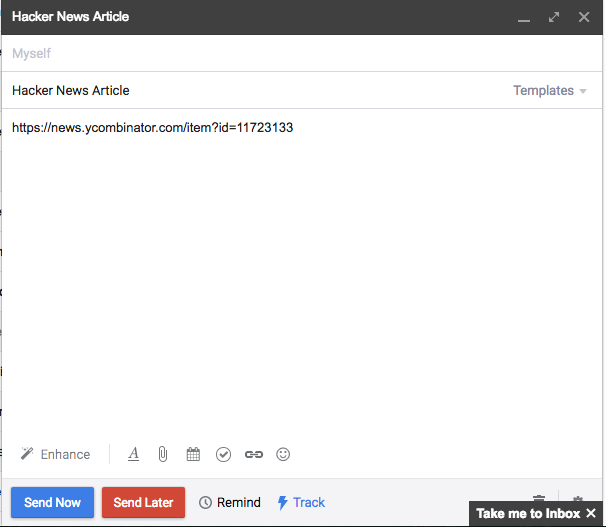
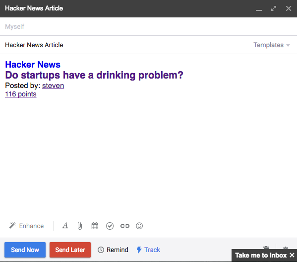

# Hacker News Link Resolver for MixMax

This is an open source Mixmax Link Resolver. See http://sdk.mixmax.com/docs/tutorial-giphy-link-preview for more information about MixMax Link Resolvers. To sum up, it essentially replaces any Hacker News article link you paste into your gmail with a preview.

 

## Running locally

1. Install using `npm install`
2. Run using `npm start`

## Adding to MixMax

Once the server is running locally open up the MixMax dashboard and add a new Link Resolver with the following information:

| Key 	             | Value                                         |
|--------------------|-----------------------------------------------|
| Description        | Hacker News (news.ycombinator.com/items?id=*) |
| Regular Expression | news\.ycombinator\.com\/item\?id=[0-9]+$      |
| Resolver API URL   | http://localhost:9146/resolver                |